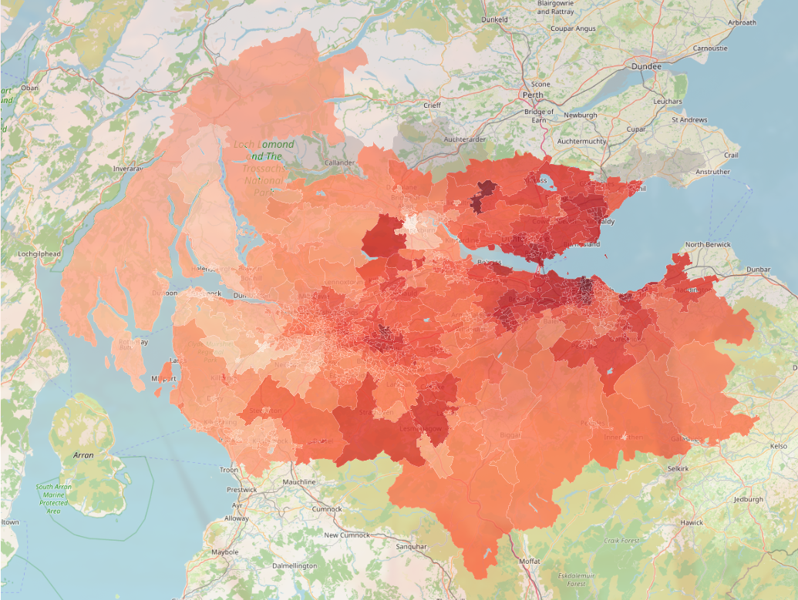

# Sentinel-5P NO₂ over Scotland's Central Belt

A Dash dashboard that pulls Sentinel-5P tropospheric NO₂ from the Copernicus Data
Space Ecosystem (CDSE) and aggregates it onto Scottish administrative geographies using
**area-weighted zonal statistics**.



---

## What it does

- **Fetches** NO₂ column density from CDSE openEO (`SENTINEL_5P_L2`) for a
  fixed area roughly about the size of the Central Belt, cached to parquet so repeated views never
  re-hit the API.
- **Renders the true pixel grid** — Each observation is drawn as a rectangle
  covering its real ground footprint.
- **Aggregates onto administrative zones** — Council areas, Intermediate Zones
  2022, or Data Zones 2022 — by area-weighted overlap.
- **Reports its own uncertainty** — Every zone carries a `coverage` fraction, and
  zones backed by too few valid data points are drawn grey rather than blindly calculated.

## Method

**Area-weighted overlap, not pixel-centre-in-polygon.** A Sentinel-5P cell here
covers approximately 13 km², whereas the median Data Zone is 0.21 km². ~63% of Data Zones contain no
pixel centre at all, so a centre-in-polygon test would return nothing for most
of the map. Each zone's mean is instead calculated as `Σ(area·NO₂) / Σ(area)` over every
pixel/zone intersection fragment.

**Areas measured in a projected CRS.** Intersection areas are computed in
EPSG:27700 (British National Grid, metres), not in degrees. A square degree is
not a constant area as weighting by degree-area would systematically over-weight
datapoints sitting furthest to the north.

**CRS is never implicit.** A CRS mismatch fails silently: no exception, just
every pixel assigned to the wrong zone. `boundaries.py` refuses to guess a
missing CRS, logs every transform, and asserts the reprojected bounds land
inside Scotland — which turns that silent failure loud in case it happens.

**Coverage travels with the mean.** A zone straddling the bbox fetched can be
handed a number confidently backed by a sliver of its area. i.e. Perth and
Kinross sits ~1% inside the box. Zones below a coverage threshold keep their
geometry but have their mean withheld, and withheld zones are *drawn in grey
rather than omitted*

## Quickstart

Requires Python 3.12+ and a free [Copernicus Data Space](https://dataspace.copernicus.eu/)
account.

```bash
python -m venv venv
source venv/bin/activate        # fish: source venv/bin/activate.fish
pip install -r requirements.txt
python app.py
```

Running 'app.py' should prompt that dashboard is open in <http://127.0.0.1:8050>. The first data request triggers a device-flow
OAuth prompt in your browser; the token is cached to disk afterwards.

Pick a date range, press **Submit**, then switch map views freely — the view
selector only ever reads already-fetched data, so it can't trigger a new API
call.

### Boundary data

Download the data sets from:
[Spatial Hub Scotland](https://spatialdata.gov.scot) into `boundaries/`:

| key in `ZONE_SETS` | dataset | national | in bbox | median area | median pixels/zone |
|---|---|---|---|---|---|
| `councils` | Council areas | 32 | 22 | 995 km² | 40 |
| `intzones` | Intermediate Zones 2022 | 1,334 | 877 | 1.53 km² | 2 |
| `datazones` | Data Zones 2022 | 7,392 | 4,813 | 0.21 km² | 1 |

That last column is the one to read before choosing a set! How much accuracy is really needed?

**Intermediate Zones ship in two coastal variants.** Use `_MHW` (cut at mean
high water), not `_EoR` (extent of realm, which runs out to sea and would
average NO₂ over open water as well).
`ZONE_SETS["intzones"]` pins MHW so an alphabetically-sorted glob can't quietly
hand back the wrong one.

All three sets are British National Grid (EPSG:27700) and are reprojected on
load. `boundaries.py` resolves files by glob, so `.shp` (with its sidecars — the
`.prj` especially), `.gpkg`, `.geojson` and `.parquet` all work. If a filename
doesn't match the patterns in `ZONE_SETS`, either rename it or add the pattern.

To inspect a newly downloaded file — CRS, attribute columns, geometry validity, or
native bounds without wiring anything up:

```bash
python boundaries.py intzones
```

If that reports the wrong column for `zone_id` or `zone_name`, add the real name
to the relevant `*_candidates` list in `ZONE_SETS`.

## Project structure

```
config.py       study area, date defaults, cache location
data.py         CDSE openEO → NetCDF → DataFrame → parquet     (the only script requiring internet)
boundaries.py   shapefile → validate → reproject → parquet     (CRS)
zonal.py        pixels + zones → area-weighted means           (analytical core)
figures.py      frames → Plotly figures                        (pure: no I/O, no state)
layout.py       widget tree
callbacks.py    the only orchestration
app.py          boots Dash
```

`figures.py` never fetches and `data.py` never draws — all wiring lives in
`callbacks.py`, so everything can be tested headlessly.

More docs available at:
[`docs/summary.md`](docs/summary.md).

## Limitations

Some obvious limitations that affect how the numbers should be interpreted:

- **Tropospheric column ≠ ground concentration.** Output is mol/m² through the
  atmospheric column (not the µg/m³ @ 2m used by air-quality regulation).
  Converting requires boundary-layer assumptions not made here. Could be a fun side project to do such estimates.
- **Negative retrievals are currently dropped.** In clean air, retrieval noise
  straddles zero and negative values are the legitimate low tail. Filtering them
  out biases means upward, worst exactly where concentrations are lowest.
  Filtering on `qa_value` instead is the correct fix and is the highest-value
  outstanding change.
- **Sub-pixel zones.** Council areas are the only set genuinely coarser than the
  pixel grid. 64% of Intermediate Zones are fed by two pixels or fewer and 63%
  of Data Zones by exactly one, so neighbouring zones return near-identical
  means. The finer sets are a presentation choice and do NOT added spatial detail!
- **Sparse coverage.** Sentinel-5P is a polar orbiter: one overpass per day, and
  swath edges, cloud and quality filtering remove most cells. A typical day
  covers ~25% of the grid, which is why the map plots data from a range rather than a single date.
- **Unweighted temporal mean.** A date with two valid cells currently counts as
  much as one with 724.

## Data sources

- **NO₂** — Copernicus Sentinel-5P TROPOMI via the
  [Copernicus Data Space Ecosystem](https://dataspace.copernicus.eu/) openEO API.
  Contains modified Copernicus Sentinel data.
- **Boundaries** — [Spatial Hub Scotland](https://spatialdata.gov.scot),
  Open Government Licence. Attribution required for published output.

## Roadmap

- [ ] `qa_value` filtering to replace the `NO₂ > 0` cut
- [ ] Population-weighted exposure (the 2022 zone files already carry population
      columns)
- [ ] Multi-year timelapse
- [ ] Tests around the weighting maths
